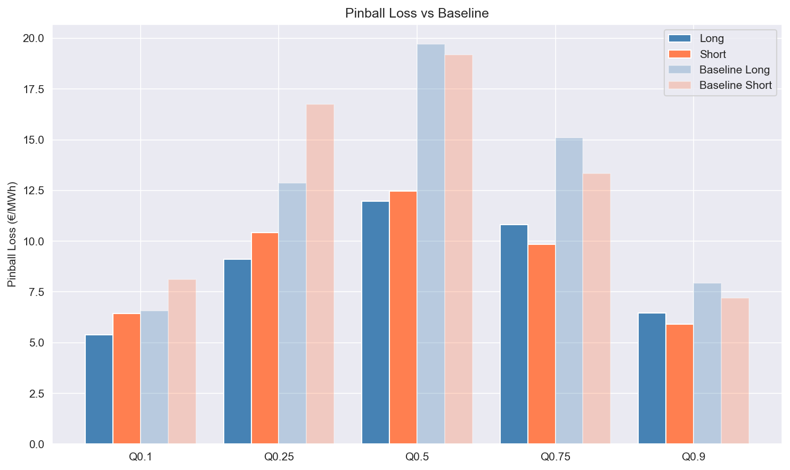
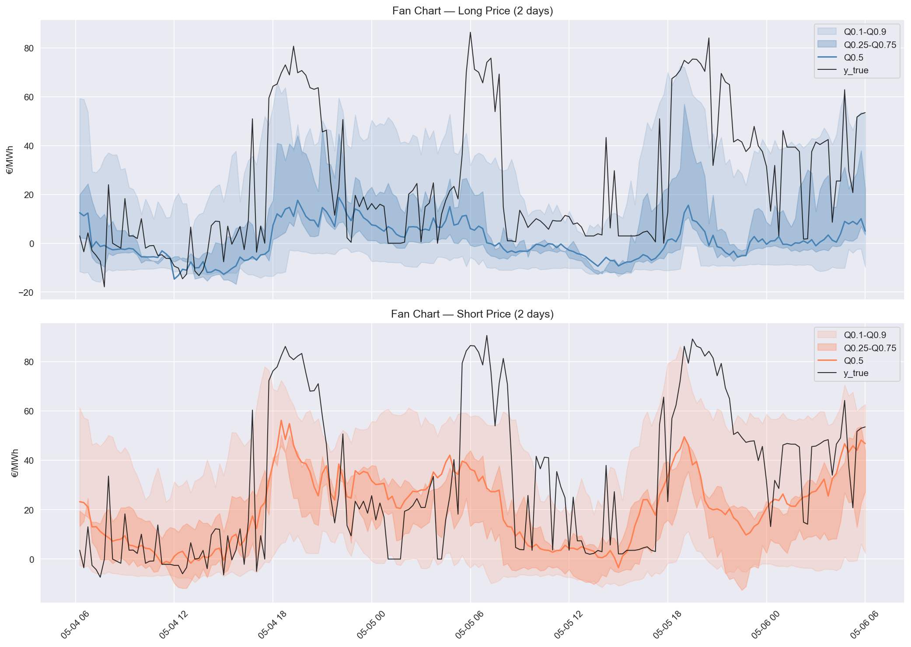
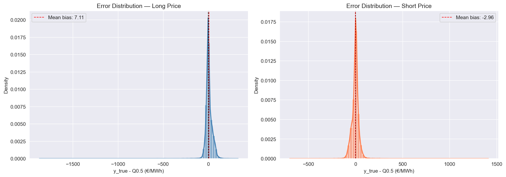
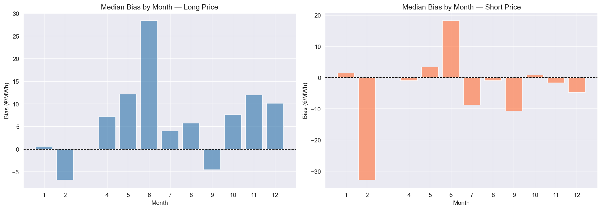

# Spanish Imbalance Price Forecast

Quantile regression model to forecast Spanish electricity imbalance prices (Long and Short) at a 2-hour horizon (+2-hour information lag), using data from the ENTSO-E Transparency Platform.

---

## Project Goal

Imbalance prices are determined after real-time balancing of the grid and are highly volatile. Forecasting them with uncertainty estimates (quantile regression) allows market participants to better manage their exposure to settlement risk.

This project builds a walk-forward backtest with LightGBM quantile models, predicting both Long and Short imbalance prices across quantiles [0.1, 0.25, 0.5, 0.75, 0.9].

---

## The Spanish Imbalance Market

When electricity producers or consumers deviate from their scheduled positions, the TSO (Red Eléctrica) must balance the grid in real time. These deviations are settled at **imbalance prices**, which differ from the day-ahead market price.

Spain uses a **dual imbalance pricing system**:

- **Long price**: applied to actors with a surplus position (they produced more than scheduled)
- **Short price**: applied to actors with a deficit position (they consumed more or produced less than scheduled)

The relationship is typically: `Long price < Day-ahead price < Short price`

The settlement depends on both the system direction and the actor's individual position:

- If the system is **short** (deficit), actors with a **long** imbalance are rewarded, while actors also short are penalized.
- If the system is **long** (surplus), actors with a **short** imbalance are rewarded, while actors also long are penalized.

The Long and Short prices reflect this asymmetry, actors helping rebalance the grid receive the favorable price, those aggravating the imbalance pay the penalty price. Both prices coexist in every 15-minute settlement period.

---

## Prediction Horizon & Information Lag

The model operates under two constraints:

- **Information lag**: actual production and consumption data is published with a ~2h delay
- **Prediction horizon**: we target 2h ahead

Combined, this means the model only uses features lagged by at least 17 periods (4h15min) to avoid leakage. All actual measurements (production, load, deltas) are replaced by their lagged versions.

---

## Repository Structure

```
imbalance-price-forecast/
├── config/
│   ├── preprocessing.yaml       # All feature engineering and lag config
│   └── model_config.yaml        # LightGBM HPO search space
├── data/
│   ├── raw/                     # Raw ENTSO-E parquet
│   ├── processed/               # Preprocessed features
│   ├── prediction_long/         # Backtest predictions for Long price
│   └── prediction_short/        # Backtest predictions for Short price
├── notebooks/
│   ├── eda_before_preprocess.ipynb   # EDA on raw data
│   └── backtest_analysis.ipynb       # Backtest results analysis
├── src/
│   ├── data/
│   │   ├── fetcher.py           # ENTSO-E API client
│   │   └── loader.py            # Path management and I/O
│   ├── preprocessing/
│   │   ├── utils.py             # All feature engineering functions
│   │   ├── transformers.py      # sklearn transformers wrapping utils
│   │   └── pipeline.py          # sklearn preprocessing pipeline
│   ├── models/
│   │   ├── QuantileModel.py     # LightGBM quantile model wrapper
│   │   ├── model_builders.py    # Pipeline and param utilities
│   │   └── hpo_tuner.py         # Optuna HPO with pinball loss
│   └── utils/
│       └── plots.py             # Reusable plot functions
└── main_backtest.py             # Walk-forward backtest entrypoint
```

---

## Data Sources

All data fetched via the [ENTSO-E Transparency Platform](https://transparency.entsoe.eu/) using `entsoe-py`:

| Source | Description |
|--------|-------------|
| Imbalance prices | Long and Short settlement prices (15min) |
| Day-ahead prices | SPOT market prices for Spain |
| Load forecast & actual | Forecasted and actual consumption |
| Generation forecast | Total scheduled production |
| Wind & Solar forecasts | Day-ahead and intraday forecasts |
| Actual generation | Per-technology actual production |
| Cross-border exchanges | Scheduled flows ES↔FR, ES↔PT |
| Net Transfer Capacity | Day-ahead NTC for ES↔FR, ES↔PT |

**Period**: 2025-01-01 to 2026-03-01 | **Granularity**: 15min | **Country**: Spain (ES)

---

## Feature Engineering

Features are built from raw data through several steps, all driven by `preprocessing.yaml`:

**Cleaning**
- Energy storage NaNs filled with 0 (sparse reporting)
- Wind/solar forecast NaNs cross-filled (day-ahead ↔ intraday), then linearly interpolated
- Remaining NaNs forward-filled

**Derived features**
- `Total_Production_Actual`: sum of all generation types minus pumping consumption
- **Delta features**: forecast minus actual for wind, solar, load, and total production, captures forecast error at the time of prediction
- `Scheduled_Imports / Exports`: aggregated cross-border flows from France and Portugal
- `Scheduled_Remainder_Volume`: net system position after accounting for all scheduled flows
- `Intraday_NTC_Available`: remaining transfer capacity after day-ahead allocation

**Temporal encoding**
- Cyclical sin/cos encoding for hour of day, day of week, and month

**Lagged features**
- All actual measurements replaced by lagged versions (min lag: 17 periods = 4h15)
- Lags selected via PACF analysis on the full dataset, then fixed in config
- Lag 17 always included as a baseline

---

## EDA Highlights

Before preprocessing, the EDA revealed:

- **Strong seasonal non-stationarity**: price distributions shift significantly by month and hour
- **Bimodality**: explained by hour of day and weekday/weekend patterns
- **Weak autocorrelation beyond 1h15**: PACF drops sharply after lag 5 for both targets
- **Daily seasonality**: PACF boost around lag 96 (~24h)

---

## Model

**Architecture**: one `LGBMRegressor` per quantile, independently trained.

**Quantiles**: [0.1, 0.25, 0.5, 0.75, 0.9]

**Targets**: Long and Short imbalance prices trained separately — 10 models total per backtest window.

**Hyperparameter optimization**: Optuna with 200 trials, optimizing pinball loss via `TimeSeriesSplit` cross-validation (5 folds) on the training window.

**Search space** (from `model_config.yaml`):

| Parameter | Distribution | Range |
|-----------|-------------|-------|
| num_leaves | Int | [10, 100] |
| max_depth | Int | [1, 10] |
| learning_rate | Log-uniform | [0.001, 0.2] |
| n_estimators | Int | [50, 1000] |
| subsample | Uniform | [0.2, 1.0] |
| colsample_bytree | Uniform | [0.2, 1.0] |
| reg_lambda | Log-uniform | [0.5, 5.0] |
| reg_alpha | Log-uniform | [0.1, 5.0] |
| min_child_weight | Log-uniform | [1, 20] |

---

## Backtest

**Setup**:
- Training window: 3 months
- Test window: 1 month (step = 1 month)
- ~10 backtest windows over the full dataset


---

## Results

### Pinball Loss vs Naive Baseline

The baseline predicts the empirical quantile of the training set, no features, no model.

| Quantile | Long Loss | Long Skill | Short Loss | Short Skill |
|----------|-----------|------------|------------|-------------|
| Q0.1 | 5.39 | 18.1% | 6.45 | 20.6% |
| Q0.25 | 9.11 | 29.2% | 10.41 | 37.8% |
| Q0.5 | 11.97 | 39.3% | 12.47 | 35.0% |
| Q0.75 | 10.82 | 28.3% | 9.85 | 26.2% |
| Q0.9 | 6.47 | 18.3% | 5.91 | 18.0% |

The model beats the baseline on all quantiles. Improvement is strongest around the median (~35-39%) and weaker at the tails (~18-20%), which is expected, extreme spikes are structurally hard to anticipate at a 4h horizon.

### Calibration

| Metric | Long | Short |
|--------|------|-------|
| Coverage [Q0.1–Q0.9] | 74.3% | 75.3% |
| Avg interval width | 70.74 €/MWh | 75.63 €/MWh |
| Median bias | +7.11 €/MWh | -2.96 €/MWh |

Coverage is slightly below the expected 80%, the model's intervals are a bit too narrow, driven by extreme spikes that fall outside. The Long price shows an underestimation bias (+7.11 €/MWh) while the Short price shows a small overestimation bias (-2.96 €/MWh)


---

## Analysis

### Pinball Loss vs Baseline



The model beats the baseline on all quantiles. Improvement is strongest around the median (~35-39%) 
and weaker at the tails (~18-20%), extreme price spikes are hard to anticipate at a 2h horizon + 2h info lag.

---

### Prediction Intervals (Fan Chart)



Most of the time the true price stays within the intervals, but extreme spikes fall outside, 
these are sudden imbalance events that cannot be anticipated from day-ahead and intraday forecasts 
alone, combined with the 2h information lag. This also explains the 74-75% coverage vs the expected 80%.

---

### Error Distribution



The error distribution looks Gaussian at first glance, but the tails tell a different story. 
Min error hits -1857 €/MWh, max 315 €/MWh, std of 37 €/MWh.\
The [-62, +100] €/MWh range 
covers the normal regime well, outside of that, the model has no chance given the information 
lag and prediction horizon.

---

### Median Bias by Month



No clear seasonal pattern, some months are overestimated, others underestimated without any 
consistent trend. The +7.11 €/MWh overall bias on Long price is not driven by a specific period 
but likely by isolated extreme events pulling the mean upward.

Results are saved to `data/prediction_long/` and `data/prediction_short/` as parquet files. Analysis is in `notebooks/backtest_analysis.ipynb`.